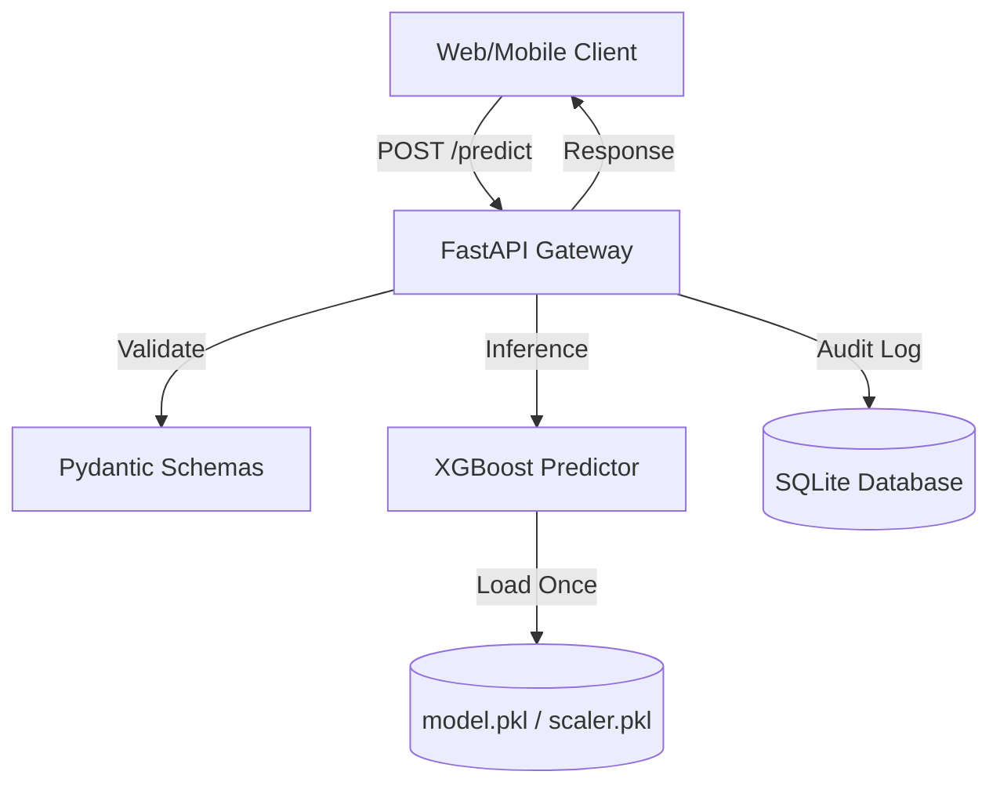

# 💳 FraudShield — Real-Time Fraud Detection API

[](https://fastapi.tiangolo.com)
[](https://xgboost.ai)
[](https://www.docker.com)
[](https://render.com)

> **Production-grade AI microservice for detecting credit card fraud in real-time.**  
> Built with a "Ship-Ready" mindset, featuring professional backend architecture, automated audit logging, containerization, and Infrastructure as Code (IaC).

---

## 📖 Table of Contents

1. [🚀 Live Demo](#-live-demo)
2. [🎯 Project Overview](#-project-overview)
3. [🏗 System Architecture](#-system-architecture)
4. [📁 Project Structure](#-project-structure)
5. [📡 API Reference](#-api-reference)
6. [🖥 Frontend Interface](#-frontend-interface)
7. [☁️ Deployment (IaC)](#-deployment-iac)
8. [🚀 Running Locally](#-running-locally)
9. [🐳 Docker](#-docker)
10. [🧠 Senior Engineering Highlights](#-senior-engineering-highlights)

---

## 🚀 Live Demo

*   **Public API**: [https://fraud-detection-api.onrender.com](https://fraud-detection-api.onrender.com)
*   **Interactive Docs**: [https://fraud-detection-api.onrender.com/docs](https://fraud-detection-api.onrender.com/docs)
*   **Web Dashboard**: [https://fraud-shield-ui.vercel.app](https://fraud-shield-ui.vercel.app)

---

## 🎯 Project Overview

This system allows financial institutions to instantly classify credit card transactions as fraudulent or legitimate. It processes **29 numerical features** (V1–V28 PCA components + transaction amount) and returns a probability score using a high-performance **XGBoost** model.

**Key Deliverables:**
*   **Low Latency**: In-memory model serving (p99 < 10ms).
*   **Robustness**: Strict input validation using Pydantic.
*   **Traceability**: SQLite-backed audit trails for every prediction.
*   **Portability**: Multi-stage Docker builds for lean production images.

---

## 🏗 System Architecture



---

## 📡 API Reference

| Endpoint | Method | Description |
| :--- | :--- | :--- |
| `/predict` | `POST` | Primary inference endpoint. Accepts 29 features. |
| `/health` | `GET` | Readiness probe for CI/CD and Load Balancers. |
| `/metrics` | `GET` | Returns aggregate stats (Total scans, Fraud rate). |

---

## 🖥 Frontend Interface

The project includes a professional **Glassmorphism-styled Web Dashboard** that allows users to:
1.  **Quick Test**: Load sample "Legitimate" or "Suspicious" data with one click.
2.  **Advanced Mode**: Manually tweak all 28 PCA features.
3.  **Real-Time Visualization**: Animated risk gauges and threshold markers.

> [!TIP]
> View the frontend code in the [`frontend/`](./frontend) directory.

---

## ☁️ Deployment (IaC)

This project uses **Render Blueprints** (`render.yaml`) for zero-config infrastructure.

1.  **Push to GitHub**: Render will automatically detect the `render.yaml`.
2.  **Create Blueprint Service**: On Render Dashboard, select "New > Blueprint".
3.  **Connect Repo**: Render will provision the Web Service, deploy the Docker container, and setup environment variables automatically.

---

## 🚀 Running Locally

```bash
# Setup
python -m venv .venv
source .venv/bin/activate  # .venv\Scripts\activate on Windows
pip install -r requirements.txt

# Run
uvicorn app.main:app --reload
```

---

## 🧠 Senior Engineering Highlights

*   **In-Memory Lifecycle**: Using FastAPI's `lifespan` to load ML artifacts exactly once at startup, preventing request-time I/O overhead.
*   **Version Compatibility**: Switched from `pickle` to `joblib` following a deep-dive analysis of scikit-learn protocol mismatches across Python environments.
*   **Security Header Middleware**: Custom middleware to inject process times and security headers into every response.
*   **Extra-Forbid Validation**: Pydantic configuration that rejects requests with extra fields to prevent "silent failures" or malicious payload padding.
*   **SQLite Audit Bridge**: A decoupled utility that logs every prediction result without blocking the main event loop.
